# CST 8911 Lab 1

## Step 1 - Screenshot: Screenshot should show the creation of Storage account, in the specified region and settings. Go to the storage account you created and Overview tab and take a screenshot showing those settings.
I couldn't make a storage account on the us east server, so I made it on the canada central server
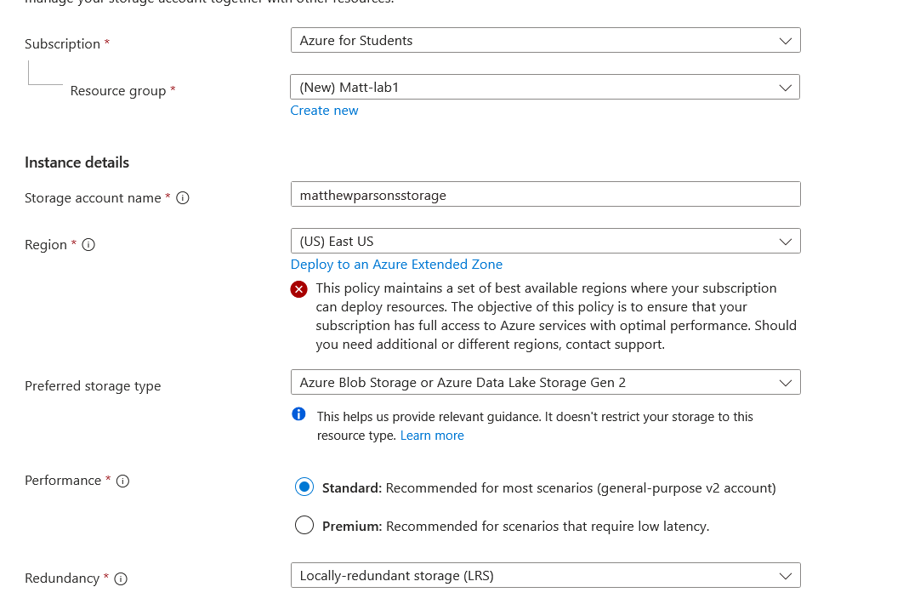

## Step 2 – Screenshot: Screenshot should show that csv file has been added to the container
sample_container.csv added to container matthewparsonsstorage

## Step 3 - Screenshot: Screenshot should show that file share has been created
file share created
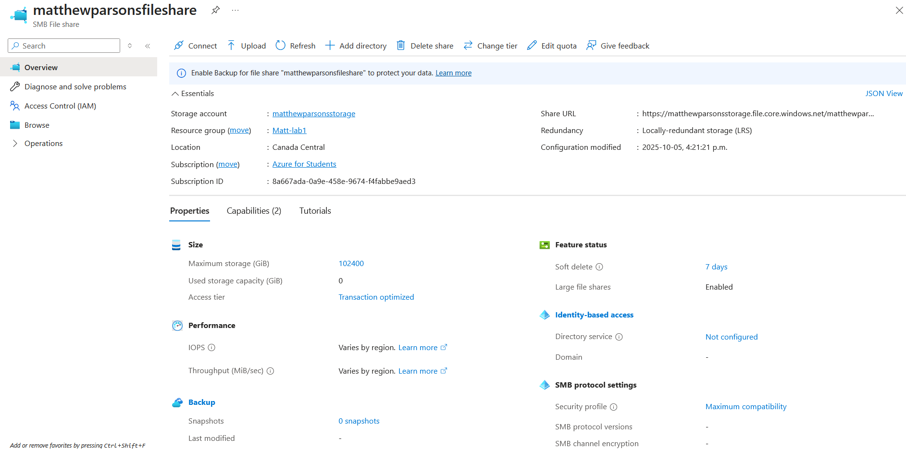

## Step 4 – Screenshot: Screenshot should show terminal with command downloading csv file and file being downloaded, show entirety of the output. Screenshot should show the csv file in your file explorer or whatever folder you’ve downloaded it to
attempt to look at file without authorizing
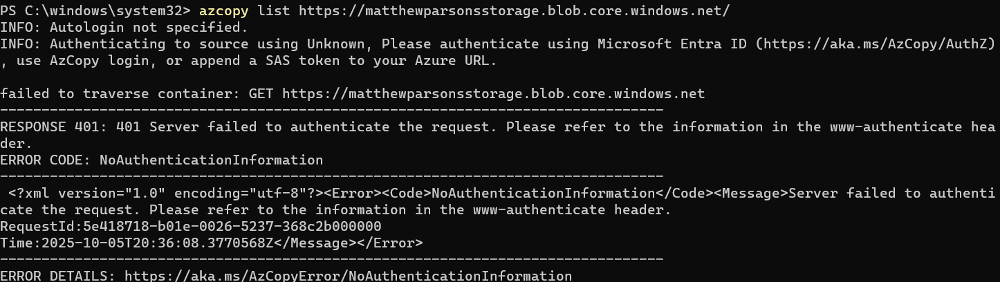

look at file after authorizing
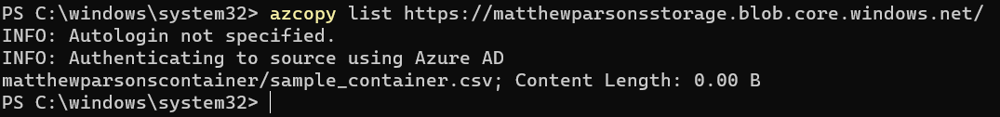

copy file
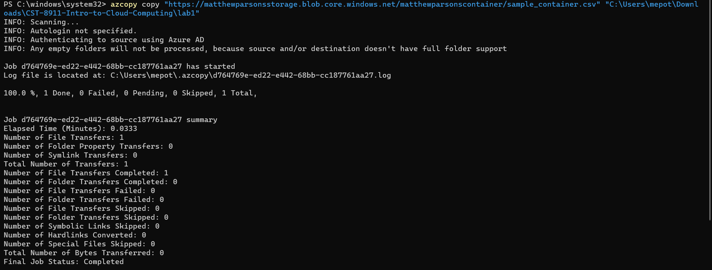

proof of successful copy
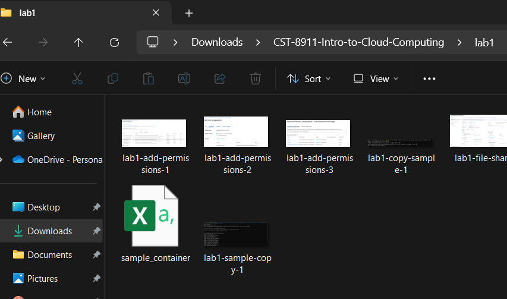

## Step 5 – Screenshot: Screenshot should show you uploading the .json file via SAS token, so show where you found the SAS token in the azure portal. Screenshot of command uploading .json file via SAS token and successful output command. Screenshot of the azure portal showing file has been uploaded
creating SAS token to use to upload file
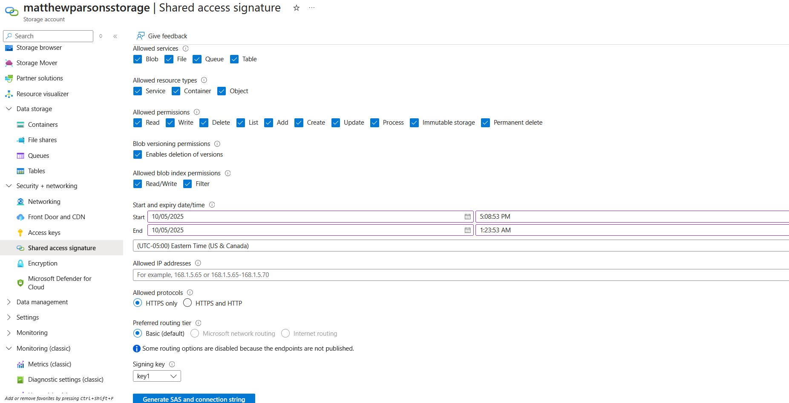

uploading file from local machine
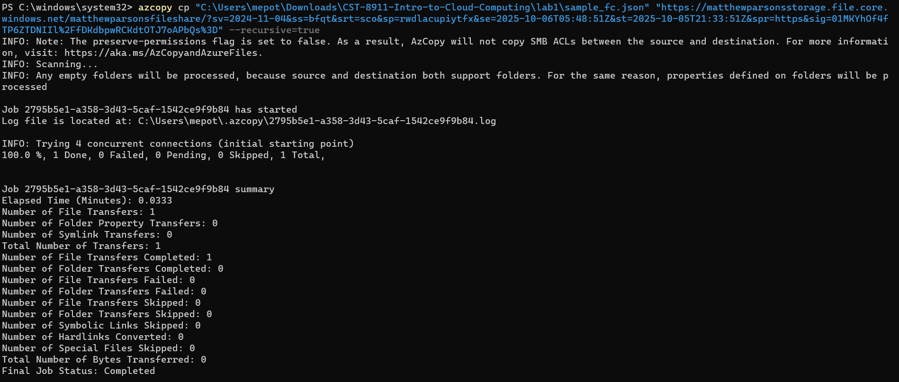

proof file successfully uploaded
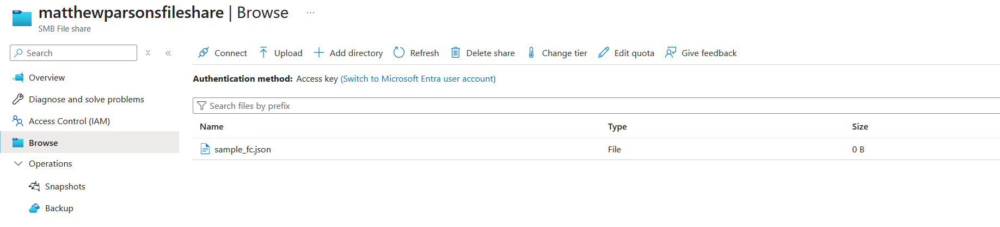

## Step 6 – Screenshot: Screenshot should show your current IAM policy that you have for that storage account
permissions upon storage account creation
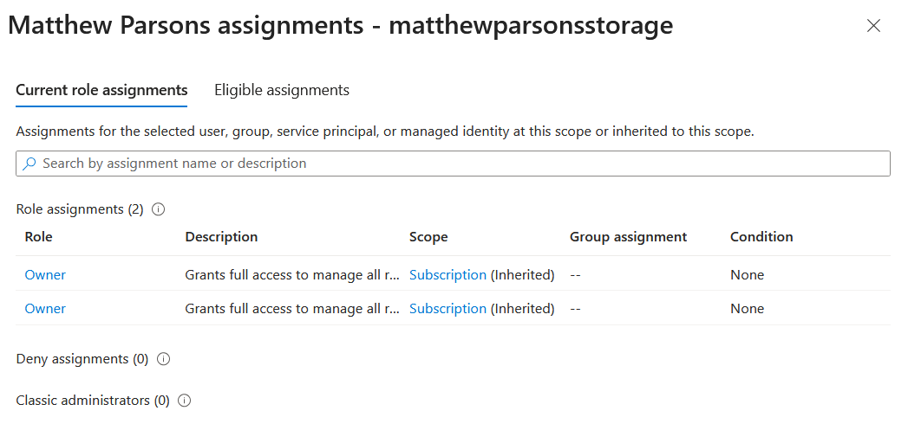

## Step 7 – Screenshot: Show each step of giving yourself the correct role
adding permissions to complete steps 4 & 5
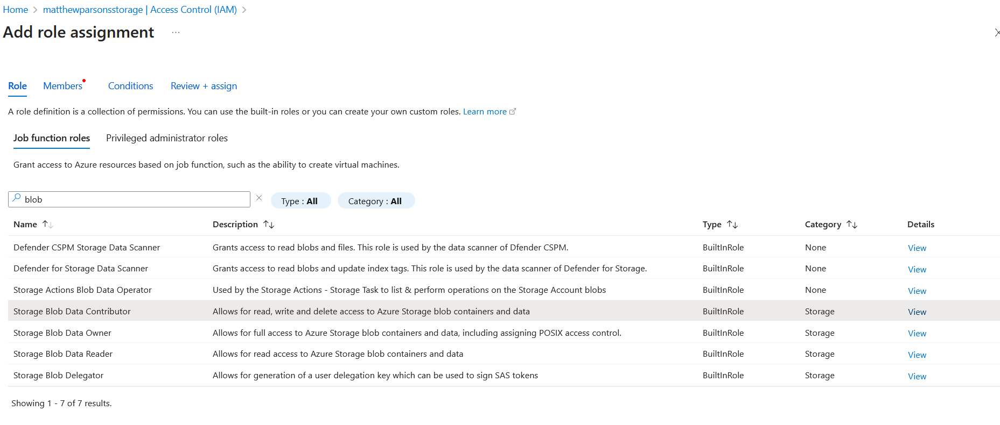
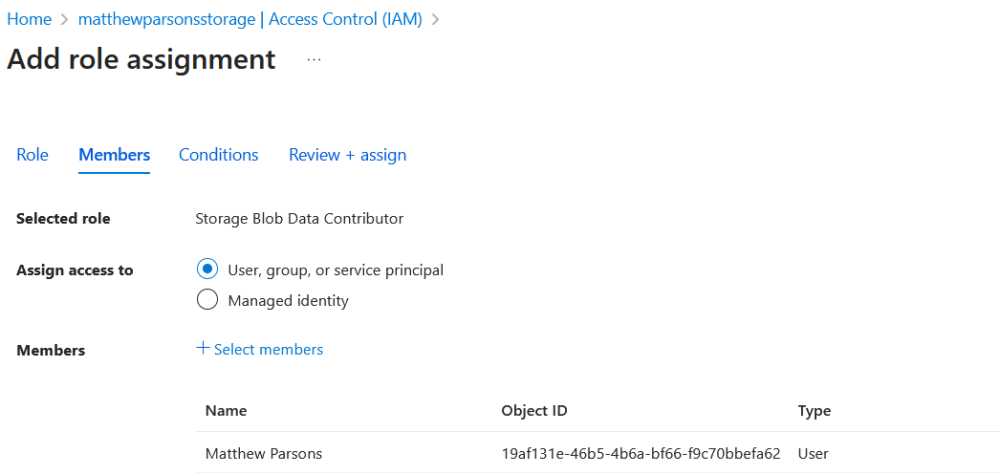
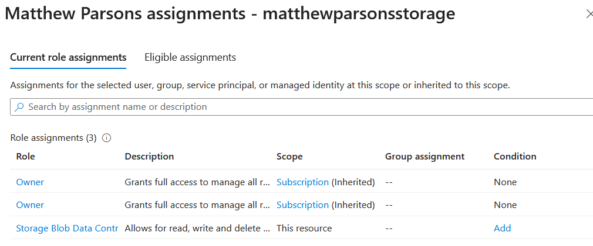

## Step 8 – Screenshot: Show you deleting storage account or resource group and successful deleted message
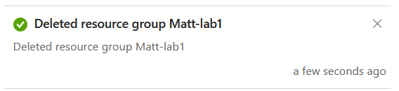