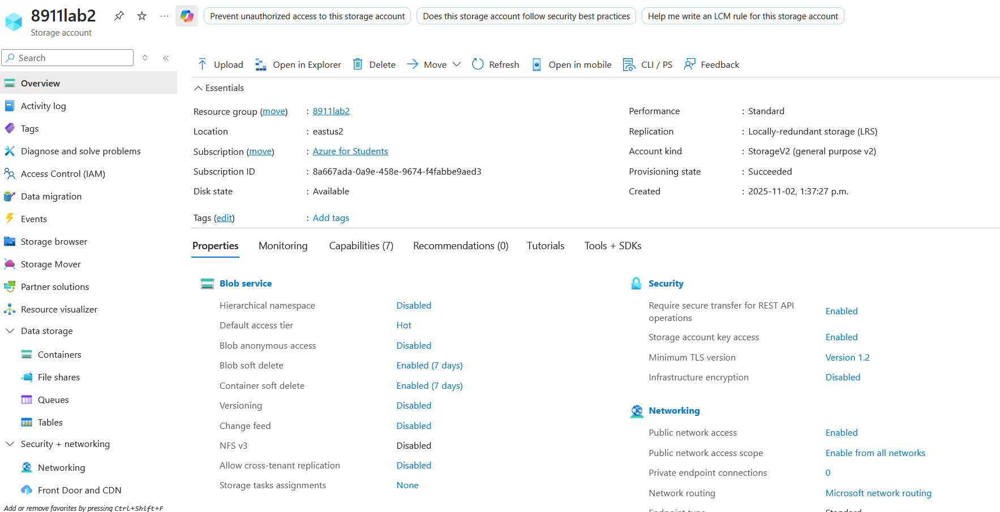
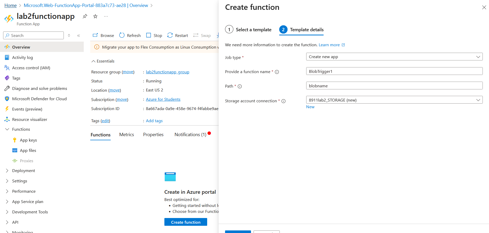
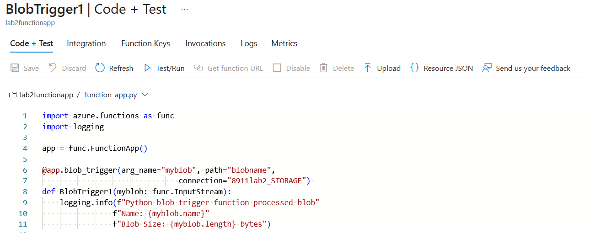
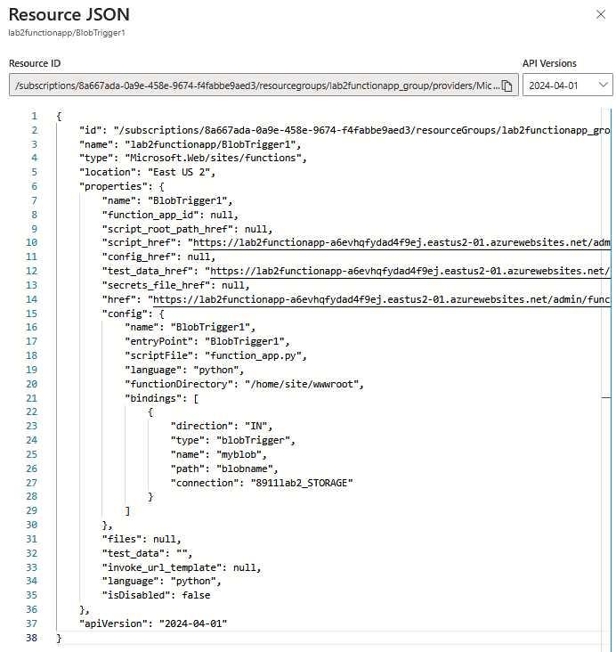
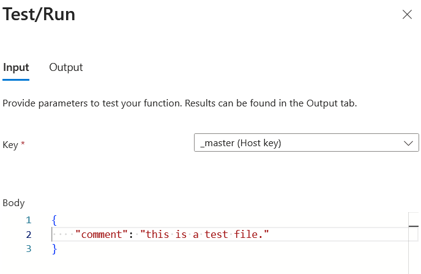
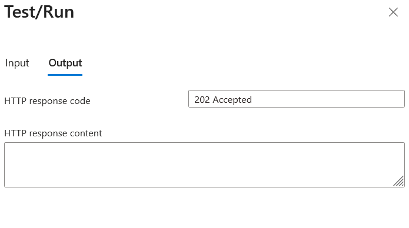

# Step 1: Storage account, overview tab screenshot, that essentially displays, name of storage account, region, and redundancy setting ie Locally redundant storage 
I wasn't able to the region eastUS, so i used eastUS2 instead

# Step 2: Screenshot of process of create azure function app, displaying the setting you selected. Need to show the runtime stack, version, region, and consumption hosting option selected

# Step 3: Screenshot of the process of creating the function app via azure portal. Ensure your storage account connection is the storage account created in step 1   

# Step 4:
### Screenshot of the code of the function 

### Screenshot of the .json file

### Screenshot of the Test/run Input file 

### Screenshot of the output

### Copy the bottom output log and paste in word doc 
2025-11-02T19:17:53Z   [Information]   Executing 'Functions.BlobTrigger1' (Reason='This function was programmatically called via the host APIs.', Id=39687f03-3968-4ab7-8873-b77bf4bfe9e8)

# Step 5: Screenshot of your resource group service and no resources underneath the resource group