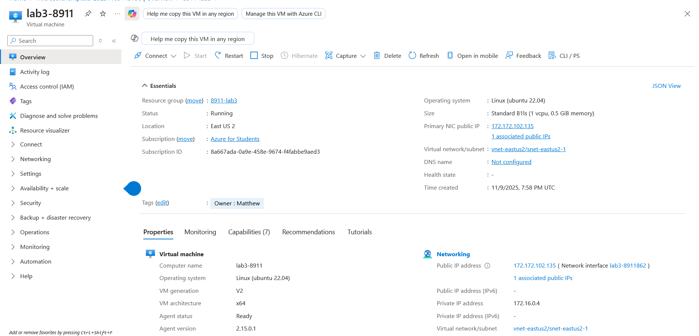
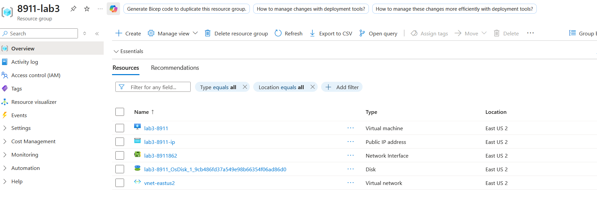
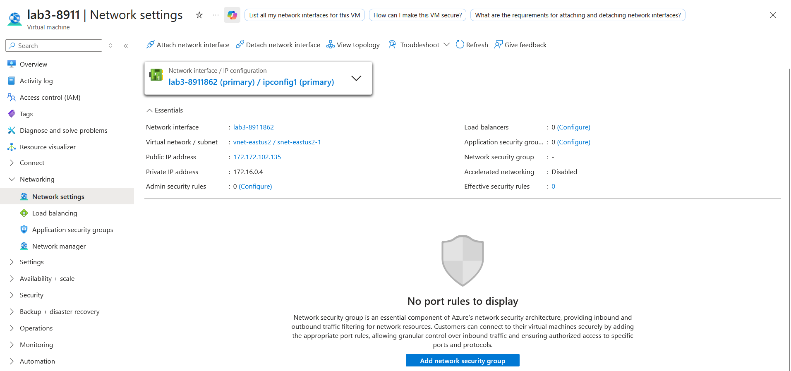
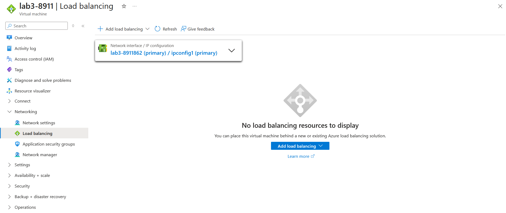
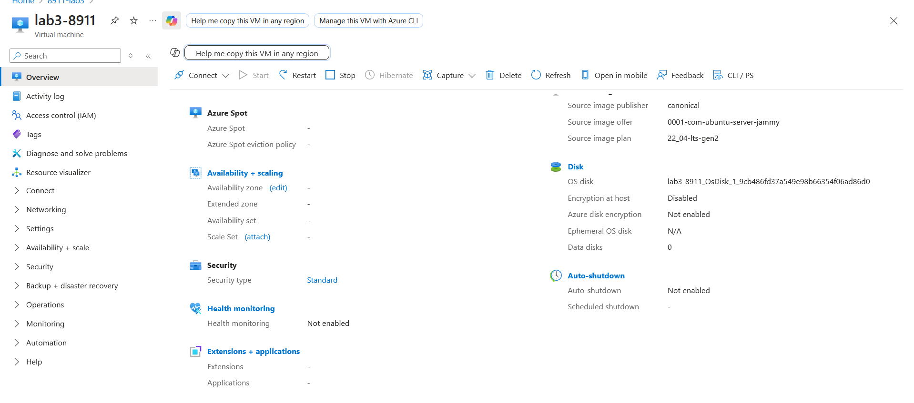

## Screenshot 1: VM successful creation / overview. Elements in Screenshot: Image, size, tags, vnet, region
East US isn't available to azure for students so I used East US 2

## Screenshot 2: all resources created by custom template. Elements in Screenshot: vnet, disk

## Screenshot 3: network security settings. Elements in Screenshot: vnet, load balancers, network security group, public inbound ports

## Screenshot 4: load balancers. Elements in Screenshot: load balancers

## Screenshot 5: VM overview continued. Elements in Screenshot: security type, disk type, availability options
