# Step 1: Create a VM
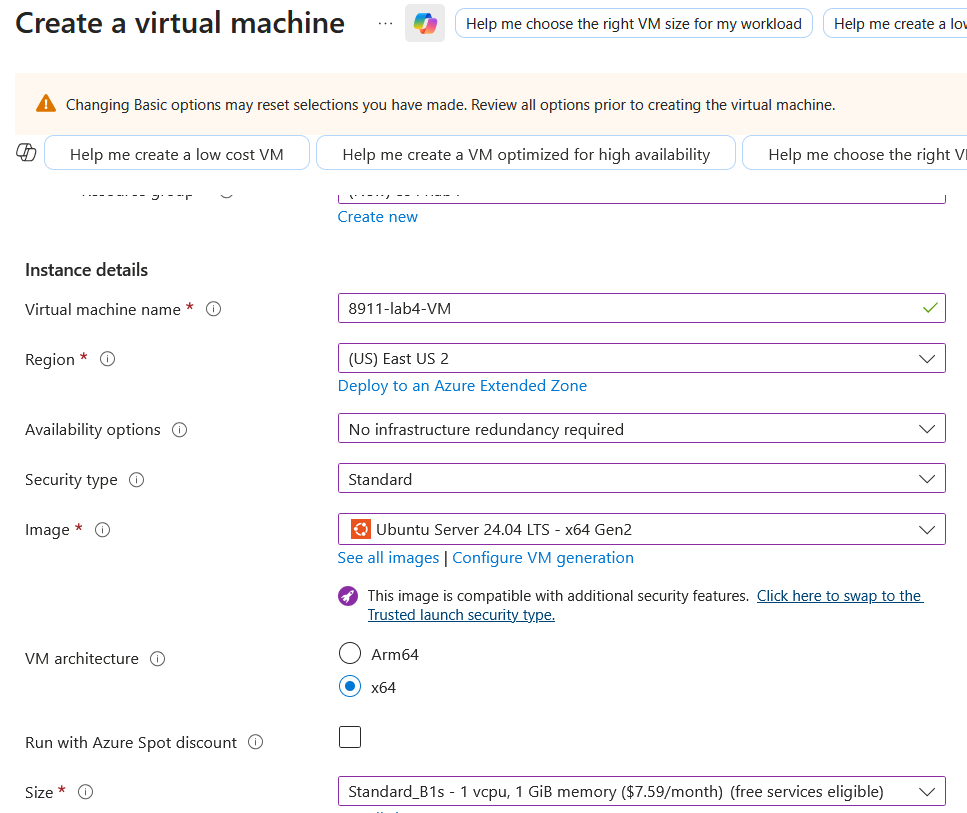
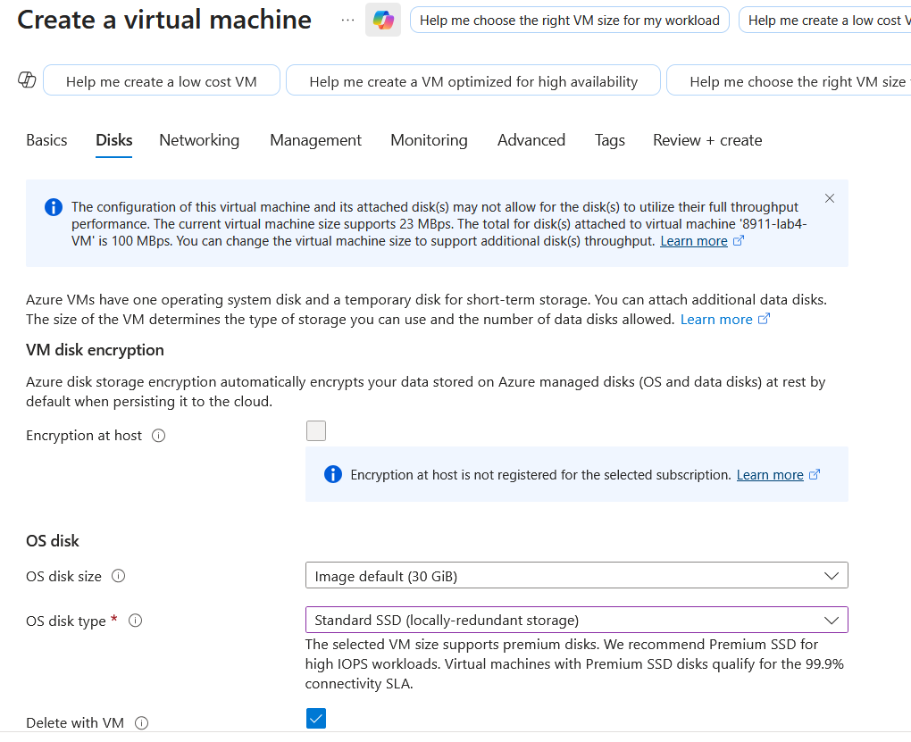
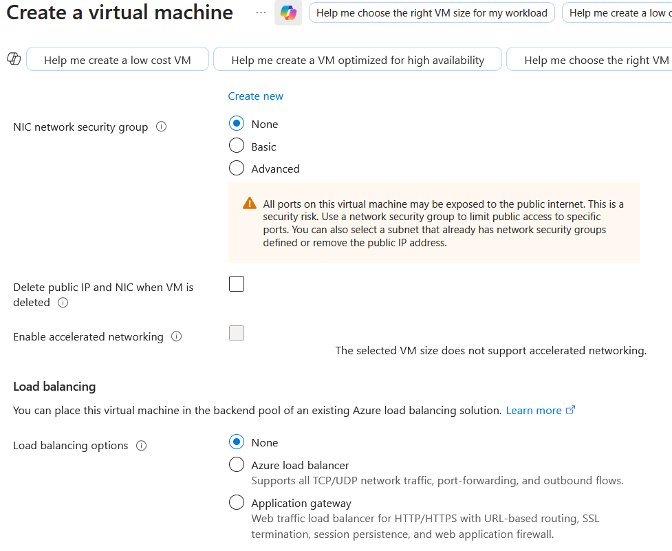
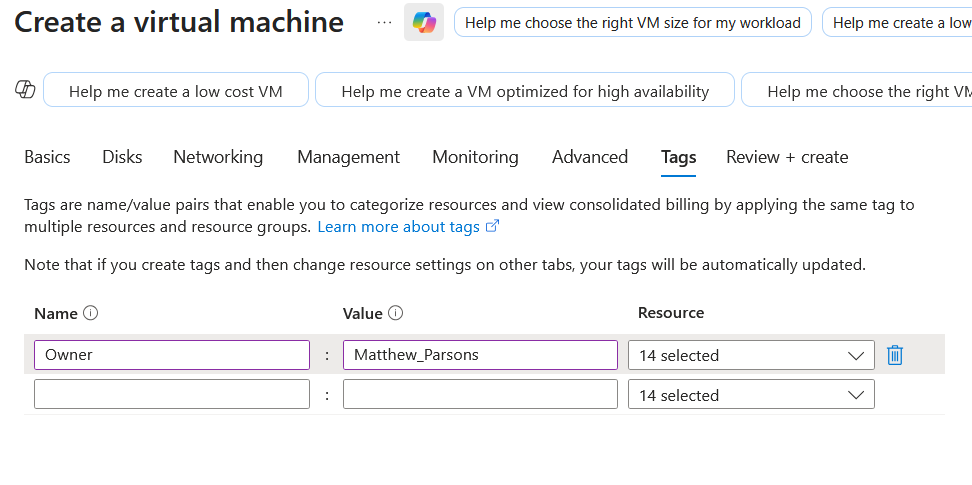
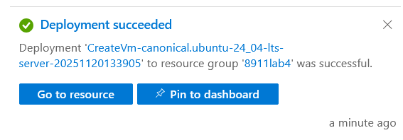

# Step 2: Create an alert rule and corresponding action group for virtual machine created in step 1, if Percentage CPU goes over certain metric stop the virtual machine
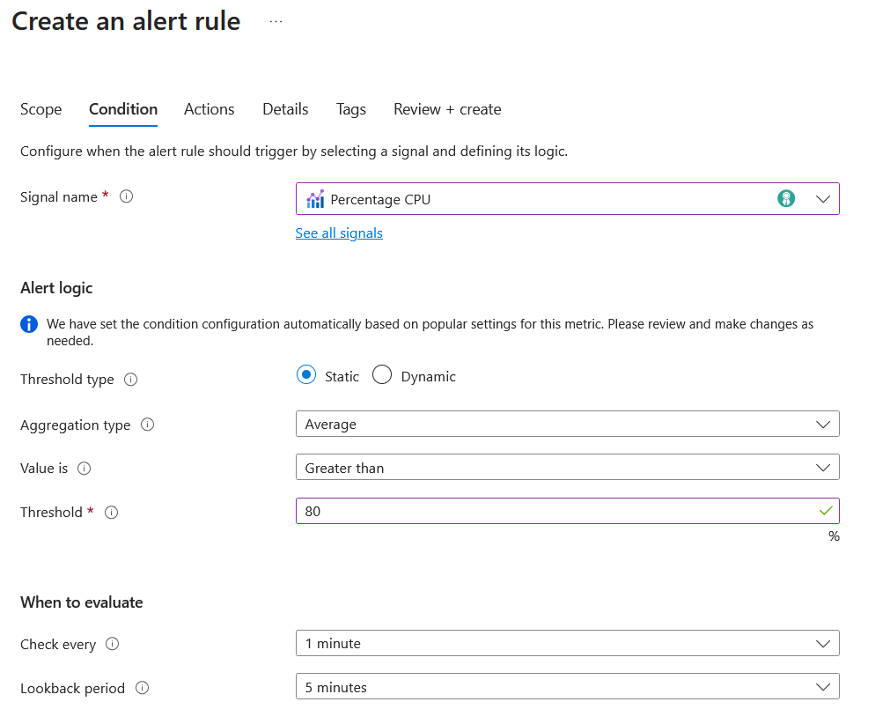
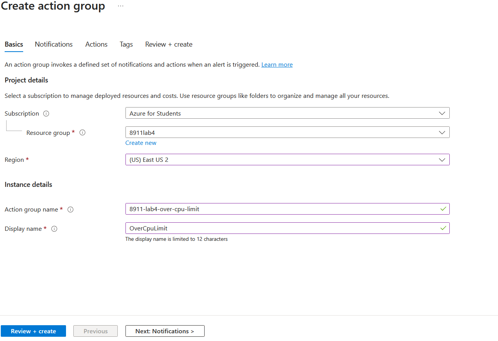
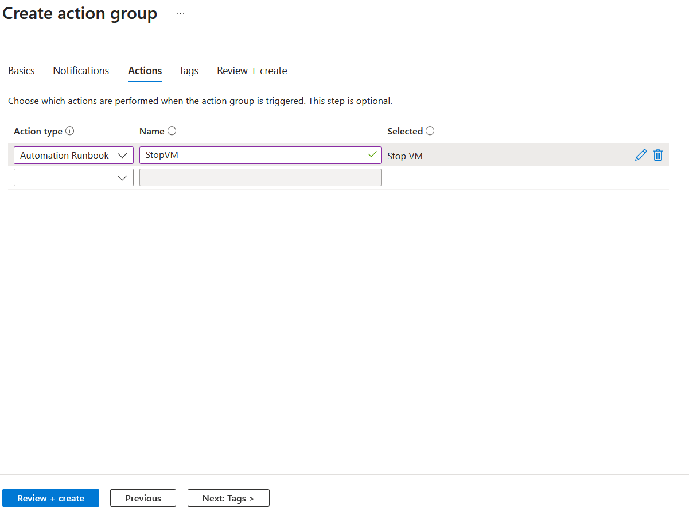
Action is linked to automation account created in step 3

# Step 3: Create an Automation account
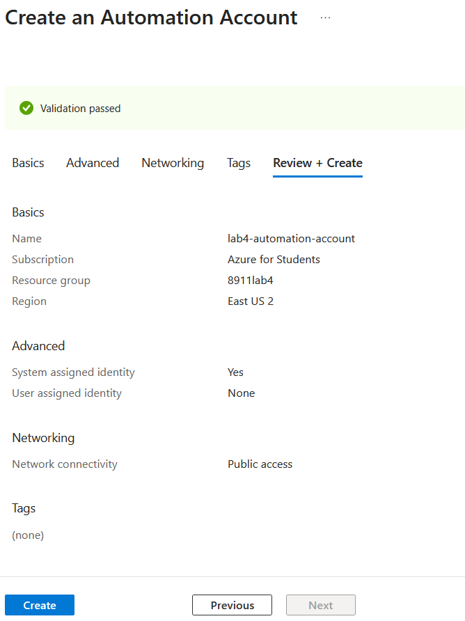

# Step 4: Create a runbook in powershell in the automation account
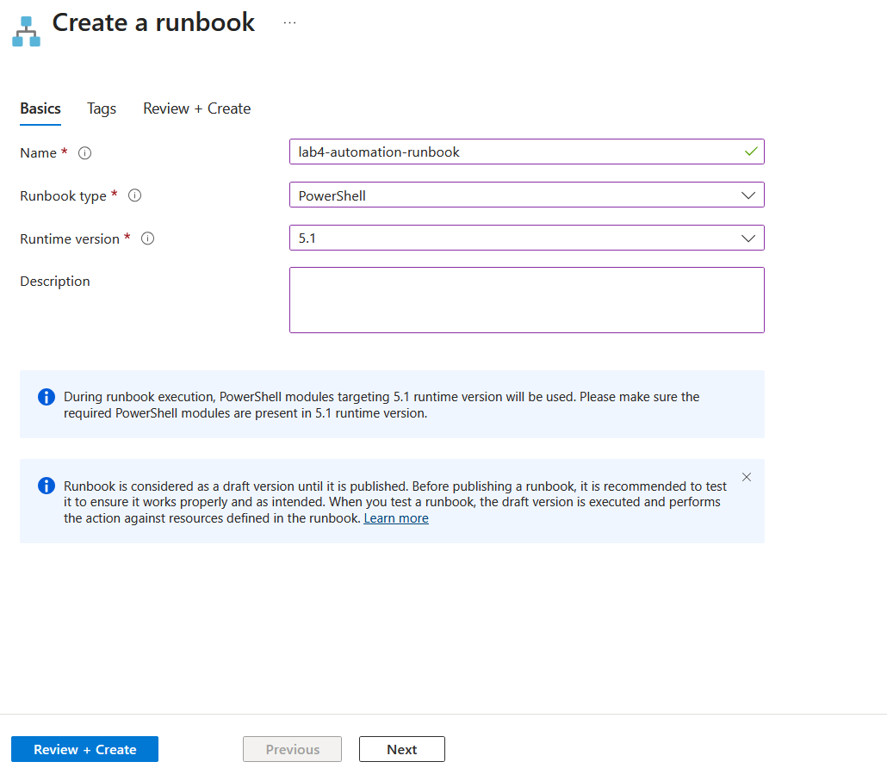

# Step 5: Edit the code so that it will stop the virtual machine you created in Step 1 if it has a specific tag and test the code to see if it stops the virtual machine
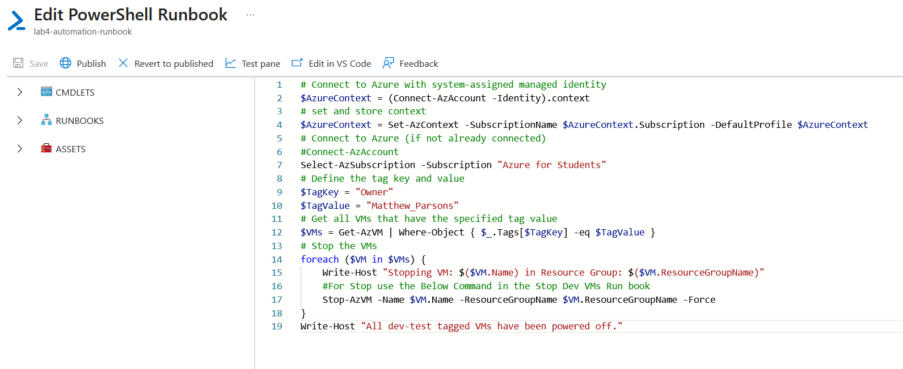
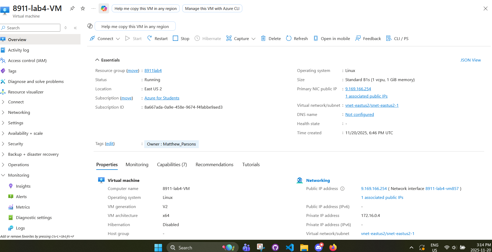

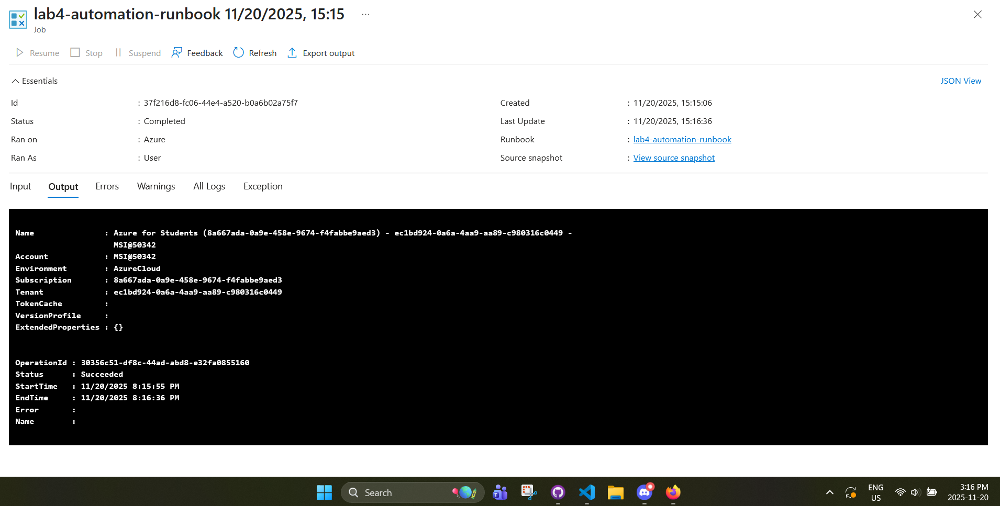
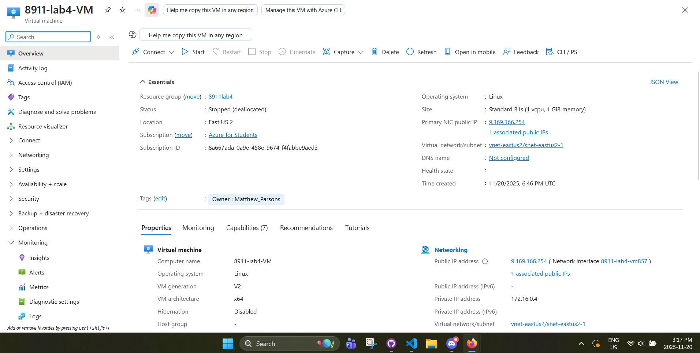

# Step 6: After demo delete all resources and policies created
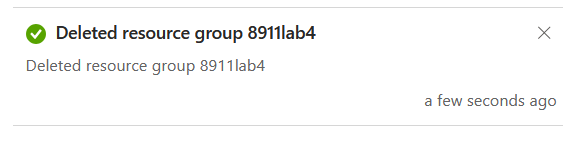