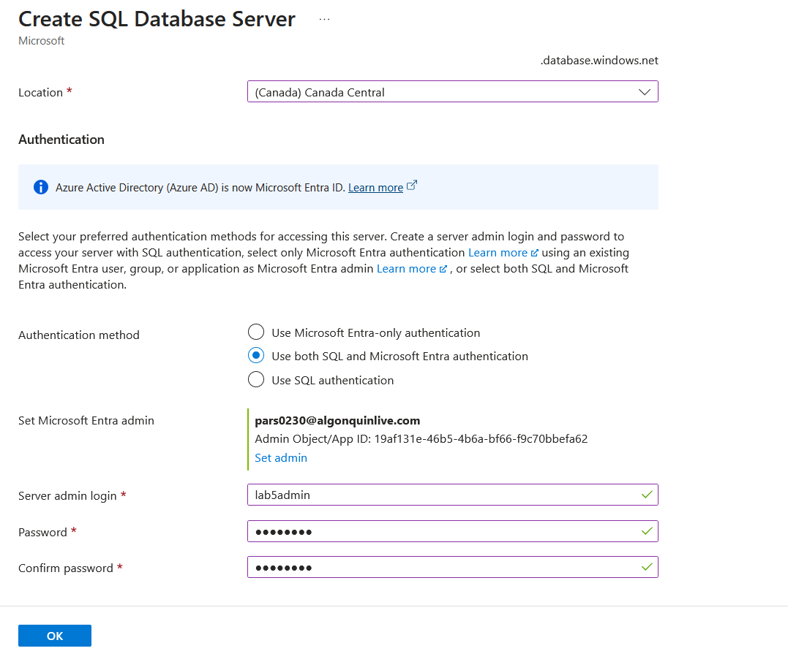
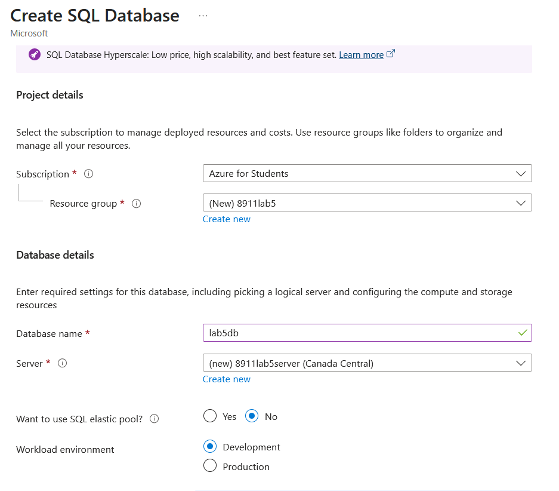
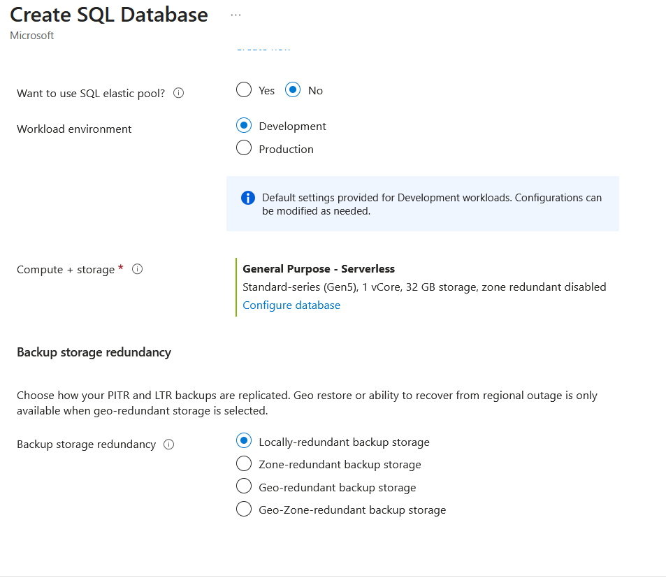
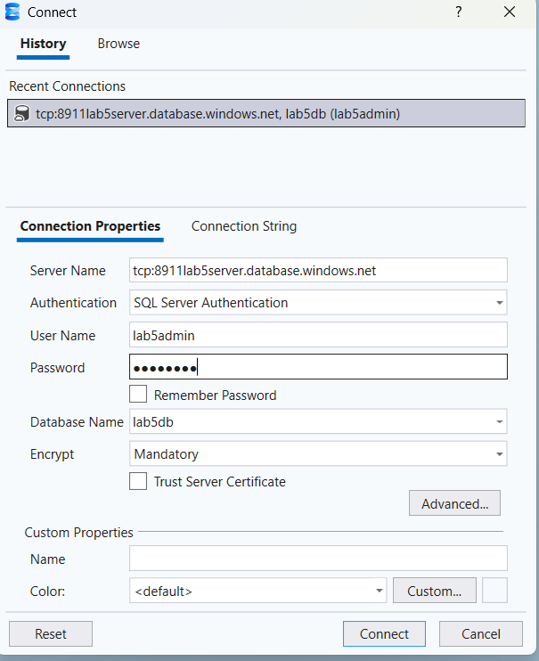
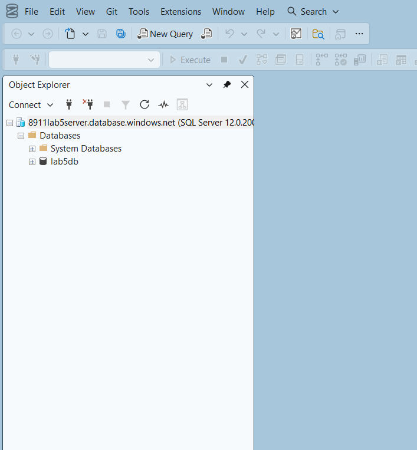
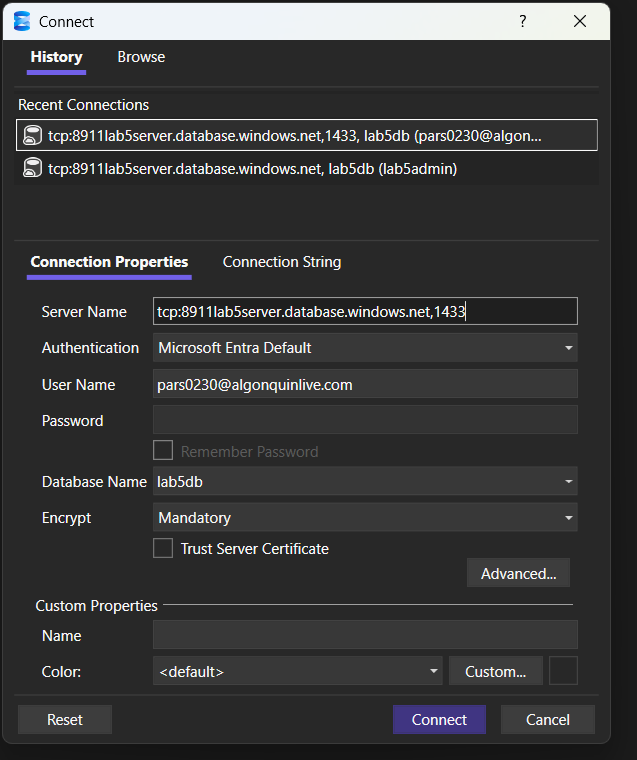
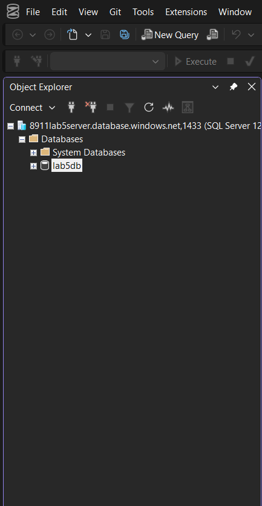
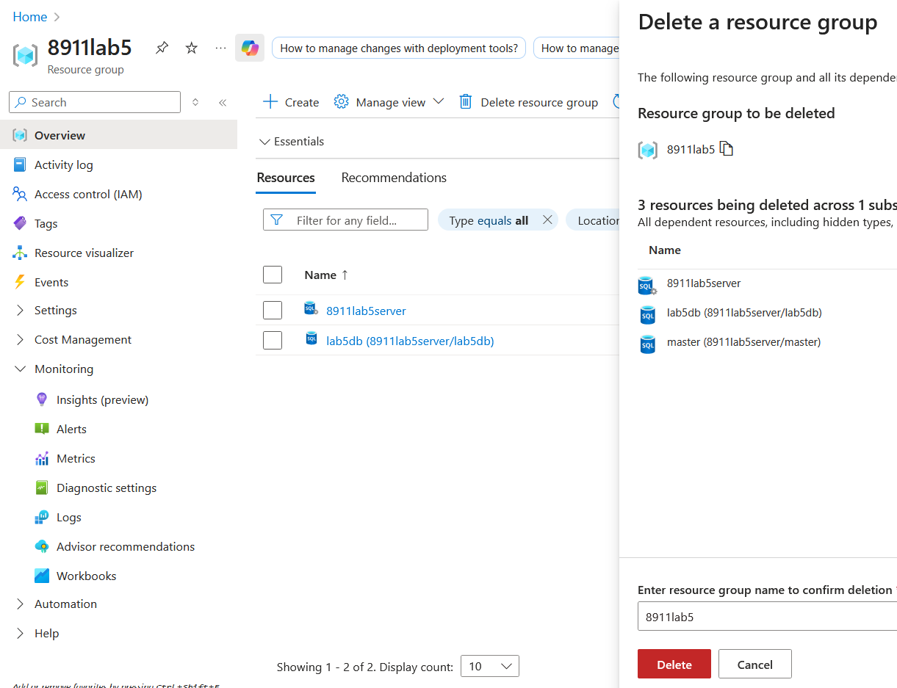

# Step 1: Create a sql database with the ability to use both SQL and Microsoft Entra authentication to login. Create for development workload environment, select locally redundant backup storage

Password: Matthew1

# Step 2: Login to the database using  SQL Server Management Studio (SSMS) or Azure Data Studio using both Microsoft authentication to install and sql login to the database created in step 1
## SQL conection

## Microsoft Entra id connection

# Step 3: Delete sql database and any other resources created
